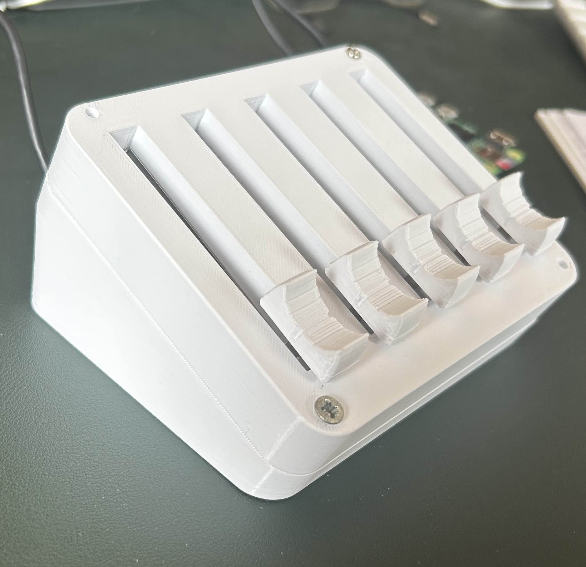
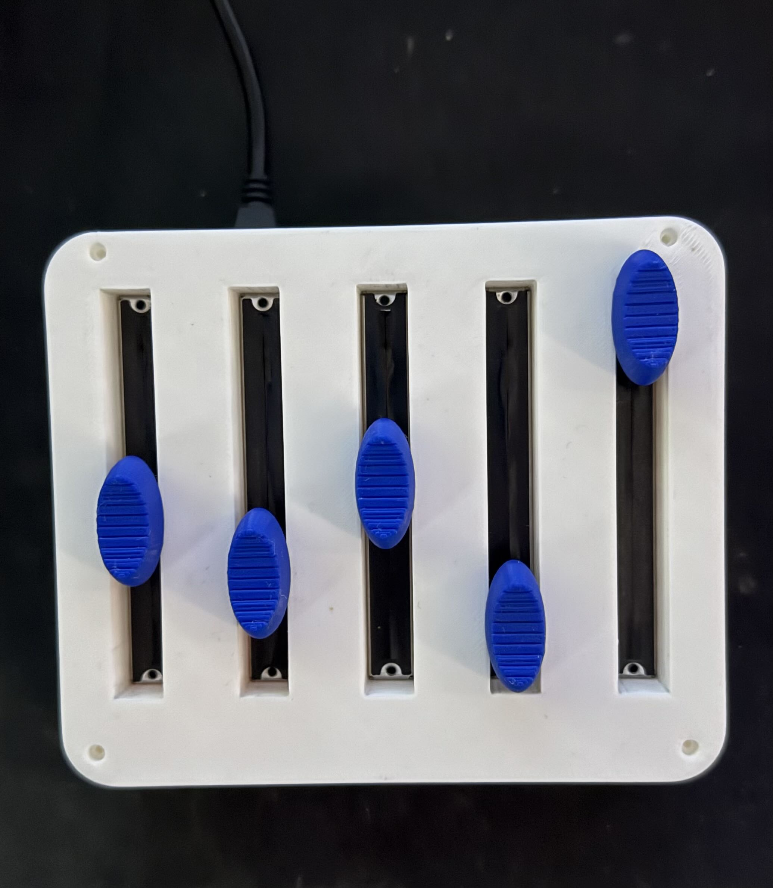
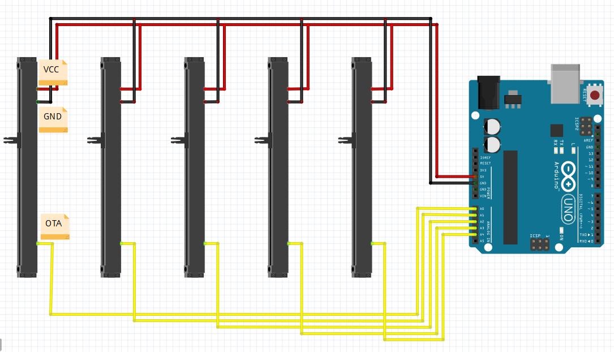

# SerialVolumeControl

SerialVolumeControl is a cross-platform desktop application that lets you control the volume of individual applications on your computer using physical sliders connected via a serial (COM) port. It is built with Avalonia UI and targets .NET 9, providing a modern, customizable, and persistent audio control experience.

---

## Features

- **Physical Slider Control:** Map up to 5 hardware sliders to specific applications.
- **Per-App Volume:** Adjust the volume of each app independently.
- **Persistent Settings:** Remembers your app-slider assignments, volumes, and last used COM port.
- **Cross-Platform UI:** Built with Avalonia for a modern look and feel.
- **Auto-Reconnect:** Automatically reconnects to the last used COM port if available.
- **Minimize to Tray:** Optionally runs in the background with a tray icon (Windows/Avalonia.NotifyIcon).

---

## Bill of materials

You can use an Arduino or similar microcontroller with potentiometers. In this build is made use of an Arduino Nano, with 5 B103 potentiometers.
Send slider values as serial data (0-1023 per slider) to the PC.
<details><summary>Click here for photo's and schematic picture</summary><br>
<p align="center">
  
  
  
</p>
</details>

## Getting Started

### Prerequisites

- [.NET 9 SDK](https://dotnet.microsoft.com/en-us/download/dotnet/9.0)
- [Avalonia UI](https://avaloniaui.net/) (handled via NuGet)
- [NAudio](https://github.com/naudio/NAudio) (for Windows audio control, handled via NuGet)
- A compatible serial device (e.g., Arduino with potentiometers/sliders)

### Installation

Download the latest executable release [here.](https://github.com/AlbertovanEckeveld/SerialVolumeControl/releases/)

<details><summary>Build project</summary><br>

	1. **Clone the repository:**

		```bash
		git clone https://github.com/AlbertovanEckeveld/SerialVolumeControl.git 
		cd SerialVolumeControl
		```

	2. **Restore dependencies:**
		```bash
			dotnet restore
		```

	3. **Build the project:**
		```bash
			dotnet build
		```
	4. **Run the application:**
		```bash
			dotnet run --project SerialVolumeControl
		``` 
</details>


## Usage

1. **Connect your serial slider device** to your PC.
2. **Launch SerialVolumeControl.**
3. **Select the COM port** (or it will auto-connect to the last used port).
4. **Assign applications** to each slider using the dropdowns.
5. **Move the sliders** to control the volume of the assigned apps in real time.
6. **Settings are saved automatically**�your assignments and volumes will be restored on next launch.

---

## Configuration

Settings are stored in `user_settings.json` in the application directory.  
Example:

```json
{
	"LastComPort":"COM4",
	"AppVolumes":{
		"Spotify":0.14956012,
		"brave":1,
		"Discord":1
	},
	"SliderApps":["Discord","Spotify","brave",null,null]
}
```

- `LastComPort`: The last used serial port.
- `AppVolumes`: Saved volume levels per app.
- `SliderApps`: The app assigned to each slider (by index).

Sample Arduino code:
```cpp
	void sendSliderData() {
	  Serial.println("slider0: " + String(analogRead(A0)));
	  Serial.println("slider1: " + String(analogRead(A1)));
	  Serial.println("slider2: " + String(analogRead(A2)));
	  Serial.println("slider3: " + String(analogRead(A3)));
	  Serial.println("slider4: " + String(analogRead(A4)));
	}
```

---


## Troubleshooting

- **App not listed?** Only running apps with a main window are shown.
- **COM port not found?** Ensure your device is connected and drivers are installed.
- **Audio not changing?** Make sure the app is running and not minimized to tray.

---

## Contributing

Pull requests are welcome!  
Please open an issue to discuss your ideas or report bugs.

---

## License

MIT License

---

## Credits

- [Avalonia UI](https://avaloniaui.net/)
- [NAudio](https://github.com/naudio/NAudio)
- [Mixer Pc volumes - Deej](https://www.thingiverse.com/thing:6548671)]

---